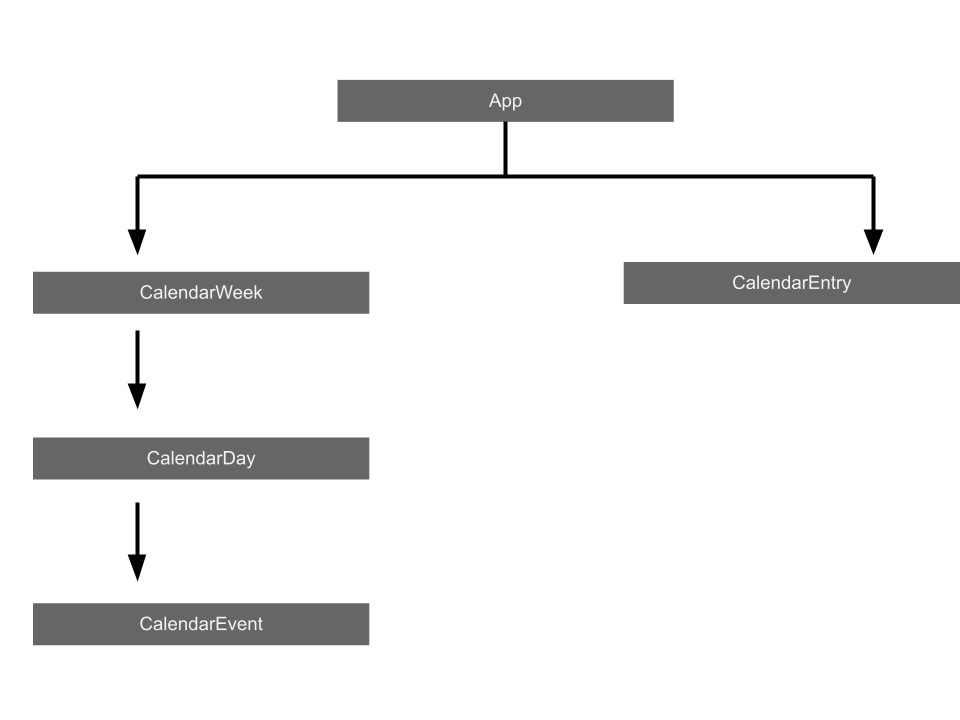
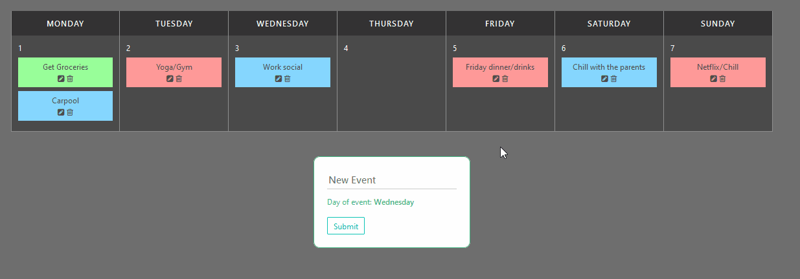

# calendar-app

## Component Architecture



## Key Features:

This project uses the Options API with a hardcoded but reactive store, using imported store methods to manage view changes when application state changes. It uses the Bulma framework for styling.

A user can select the date they would like to pin an event to, write a custom event, edit the event title and also delete events.



## Things learnt/practiced:

1. Managing components using props and the Options API.
2. An introduction to state management through imported methods.
3. Approaching a project by thinking about component architecture and parent/child or sibling relationships.


## Project setup
```
npm install
```

### Compiles and hot-reloads for development
```
npm run serve
```

### Compiles and minifies for production
```
npm run build
```

### Lints and fixes files
```
npm run lint
```

### Customize configuration
See [Configuration Reference](https://cli.vuejs.org/config/).
